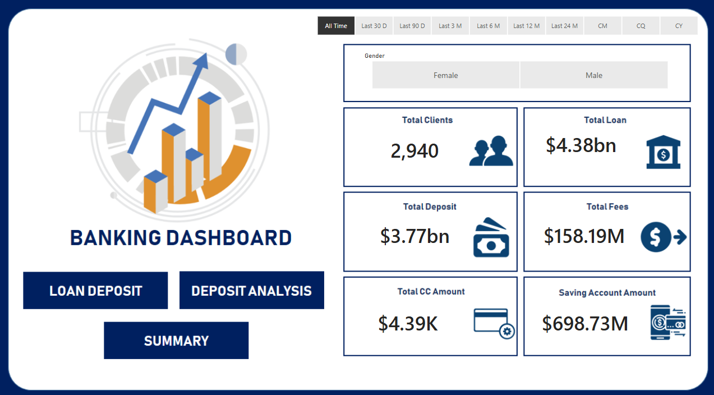
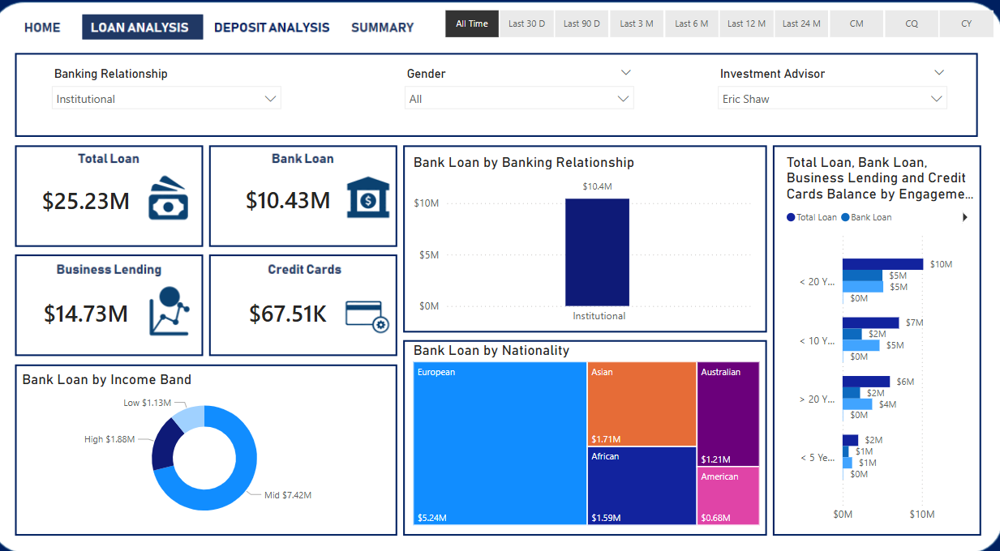
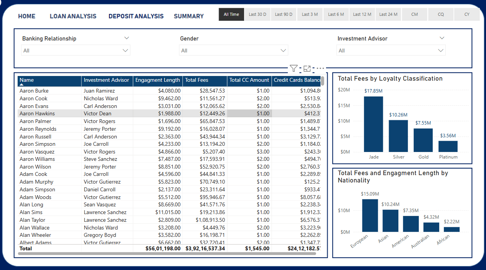

# 💼 Banking Dashboard - Risk Analytics using Power BI

## 🧩 Problem Statement

Develop a basic understanding of **risk analytics** in banking and financial services. Learn how data can be used to minimize the risk of financial loss by assessing the **repayment ability** of loan applicants before approving credit.

## ✅ Solution Overview

This interactive dashboard, built with **Power BI**, helps decision-makers analyze customer profiles to assess the **likelihood of loan repayment**. Using insightful visuals and key metrics, the dashboard guides banks in approving or rejecting loan applications based on reliable data indicators.

---

## 📊 Dashboard Highlights

The Power BI report consists of **five key dashboards**:

1. **Home** – Overview of banking KPIs and metrics
2. **Loan Analysis** – Detailed view of loan-related metrics
3. **Deposit Analysis** – Insights into deposits and savings patterns
4. **Summary** – Consolidated performance indicators
5. **Drill Through** – Deeper exploration of individual client data

---

## 🧠 Power BI Features Used

- **Slicers** for filtering views
- **Treemaps** to analyze category-based distributions
- **Bar Charts** for comparison across categories
- **DAX Measures** for dynamic calculations
- **Interactive Visuals** for enhanced user experience

---

## 🗃️ Dataset Overview

The dataset comprises multiple interrelated tables, connected via primary and foreign keys. Main data sources include:

- `Banking.xlsx` – Structured client and transaction data
- `datasets/` – Folder containing 4 CSV files
- Tables:
  - `Banking Relationship`
  - `Client-Banking`
  - `Gender`
  - `Investment Advisor`
  - `Period`

### 📌 Custom Columns Created

- **Engagement Timeframe** – Timeline of client-bank relationship
- **Engagement Days** – Total days client remained active
- **Income Band** – Categorized as:
  - `< 100000` → Low
  - `< 300000` → Mid
- **Processing Fees** – Derived column named `Fee Structure`

---

## 🧪 Data Preparation & Analysis

- Performed exploratory data analysis (`EDA.ipynb`)
- Documented DAX measures and data transformation steps in `Banking Report.docx`
- Applied Power Query transformations inside Power BI

---

## 📥 Getting Started

### 🔧 Prerequisites

- [Power BI Desktop](https://powerbi.microsoft.com/desktop/)
- Git

### 📦 Clone the Repository

```bash
git clone https://github.com/ruchisingh-dev/Banking-Risk-Analysis.git
cd Banking-Risk-Analysis
```

### 📂 Project Structure

```
banking-dashboard/
│
├── Banking Dashboard.pbix         # Main Power BI report
├── Banking.xlsx                   # Base dataset
├── Banking Report.docx            # Notes on DAX & transformation
├── EDA.ipynb                      # Exploratory Data Analysis in Python
├── datasets/                      # Folder with additional CSV files
│   ├── banking-clients.csv
│   ├── banking-realtionships.csv
│   ├── gender.csv
│   └── investment-advisiors.csv
└── README.md                      # Project documentation
```

---

## 📸 Preview






---
